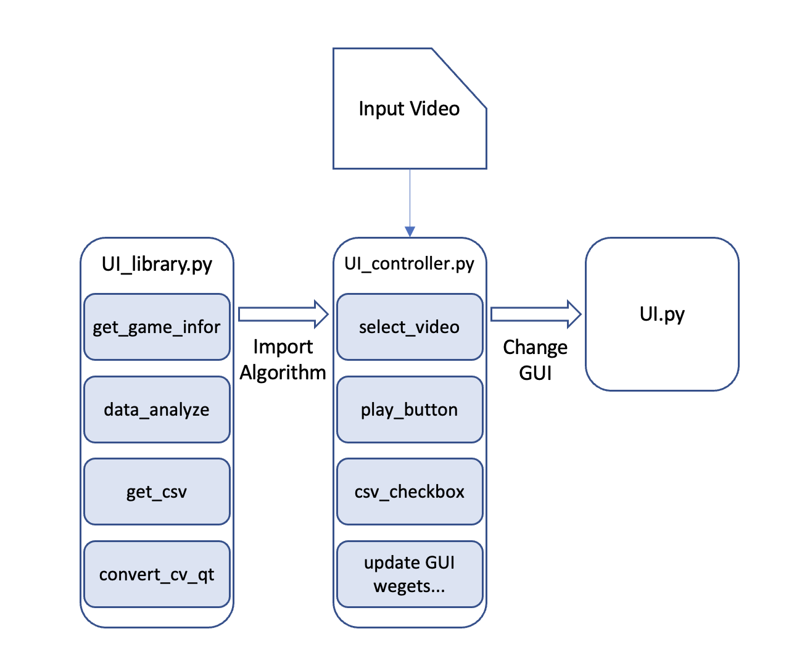
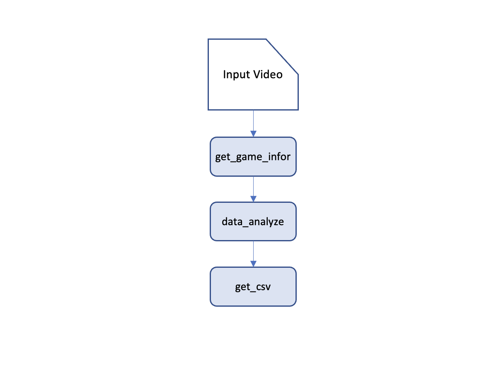
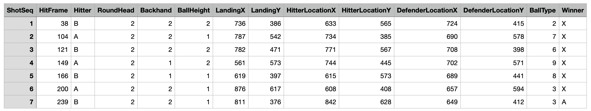

# Develop Documentation
---
## Flow chart



---
## api
### `src/UI_library.py`
### import packages
```
from pathlib import Path
import cv2
import pandas as pd
```
#### `get_game_infor()`
Use the trained ML model to predict target video and generate a pd.DataFrame involving all the hit frame information. 
#####output pd.DataFrame:

```
def get_game_infor(video_path: str = None) -> (pd.DataFrame)
```
- `Input`
  - video_path : Path of the target video. 
- `Output`
  - pd.DataFrame : The prediction from the model. 

#### `data_analyze()`
Use the returned pd.DataFrame to get any valuable command, such as hitting habit, areas of vulnerability in defense, and ball speed (with a personalized definition of what constitutes fast or slow). 
#####example for analyze_output:
```
Player A in this game tends to use a backhand stroke, and their shots are characterized by high speed.
```
```
def data_analyze(game_infor: pd.DataFrame = None) -> (str)
```
- `Input`
  - game_infor : The prediction from the model. 
- `Output`
  - str : The analysis output.
#### `get_csv()`
Save the game_infor from `data_analyze()` to folder `saved_csv`, the format of the csv filename is 
```
def get_csv(pd.Dataframe) -> (None)
```
- `Intput`
  - game_infor : The prediction from the model.

#### `convert_cv_qt()`
```   
def convert_cv_qt(cv_img):
    rgb_image = cv2.cvtColor(cv_img, cv2.COLOR_BGR2RGB)
    h, w, ch = rgb_image.shape
    bytes_per_line = ch * w
    convert_to_Qt_format = QtGui.QImage(rgb_image.data, w, h, bytes_per_line, QtGui.QImage.Format_RGB888)
    p = convert_to_Qt_format.scaled(self.disply_width, self.display_height,Qt.KeepAspectRatio)
    return QPixmap.fromImage(p)
```
---
### `src/UI_controller.py`
### import packages
```
import sys
import cv2
from PyQt6 import QtGui, QtWidgets, QtCore
from PyQt6.QtWidgets import *
from PyQt6.QtGui import *
from PyQt6.QtCore import *
```
####`class VideoThread(QThread)`
```
skip
```
####`class App(QtWidgets.QMainWindow)`

#### `App.closeEvent()`
```
def closeEvent(self, event):
    self.thread.stop()
    event.accept()
```
#### `App.setup_control()`
```
Put all the button connections here.
```

#### `App.update_mes()`
#### `App.update_frame()`
---
### `src/UI.py` (Generated by Pyqt6)
```
skip
```
---
